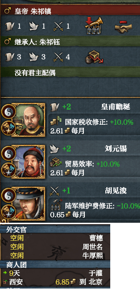

# eu4dll_mac

本项目是 [matanki-saito/EU4dll](https://github.com/matanki-saito/EU4dll) 项目的 macOS 实现，皆在使MAC玩家也能享受到原游戏不支持的本地化MOD。

在此非常感谢原项目的贡献，没有原项目也就没有这个项目。

This project is the macOS implementation of the [matanki-saito/EU4dll](https://github.com/matanki-saito/EU4dll) project, aiming to allow Mac players to enjoy localization mods that are not supported by the vanilla game.

Special thanks to the contributions of the original project; without it, this project wouldn't exist.

* 本项目基于`EU4 1.37.5`版本开发，理论上也支持其他1.37版本，但不会支持低于1.37的版本。
* 原项目中使用 `¿` 字符开启颠倒姓名的功能未实现。

* This project is developed based on the `GOG version of EU4 1.37.5`. Theoretically, it supports other 1.37 versions, but versions below 1.37 will not be supported.
* The feature from the original project that uses the `¿` character to reverse names has not been implemented.

## 运行截图 Screenshots

## 特色功能 Key Features
* 支持加载纯UTF8 BOM编码的本地化文件(.yml)，无需预先转码。

  Supports loading localization files (.yml) in UTF-8 BOM encoding directly, eliminating the need for pre-conversion.
* 启用汉化MOD时，游戏内的查找功能将支持拼音和首字母搜索。（由 [cpp-pinyin](https://github.com/wolfgitpr/cpp-pinyin) 库提供支持）

  When the chinese localization MOD is enabled, the in-game find function supports Pinyin and initials (powered by the [cpp-pinyin](https://github.com/wolfgitpr/cpp-pinyin) library).
* 将东亚文化组的人名修改为姓在名前。

  Adjusts the name display for East Asian culture groups to follow the "Surname First" format.

## 安装教程 Installation Guide

在 [Releases](https://github.com/PoXiao-zero/eu4dll_mac/releases) 页面下载最新的压缩包，解压后您会看到 `libeu4dll_mac.dylib` (核心动态库)、[insert_dylib](https://github.com/tyilo/insert_dylib)（注入工具）、 `install.sh` (自动安装脚本)。

Download the latest archive from the [Releases](https://github.com/PoXiao-zero/eu4dll_mac/releases) page. After extracting it, you will see `libeu4dll_mac.dylib` (core dynamic library), [insert_dylib](https://github.com/tyilo/insert_dylib) (injection tool) and `install.sh` (auto installation script).

### 安装 Installation

1. 打开 Mac 自带的 **终端** 应用程序。

   Open the built-in **Terminal** application on your Mac.
2. 输入`chmod +x `后拖入解压出来的 `install.sh`后回车(授予可执行权限)。

   Input `chmod +x `, drag the extracted install.sh file into the terminal, and press Enter (grant executable permissions).
   
   示例（Example）：`chmod +x /xx/install.sh`
3. 再次将`install.sh` 拖入终端窗口，按下回车键。

   Drag install.sh into the terminal window again and press Enter.
